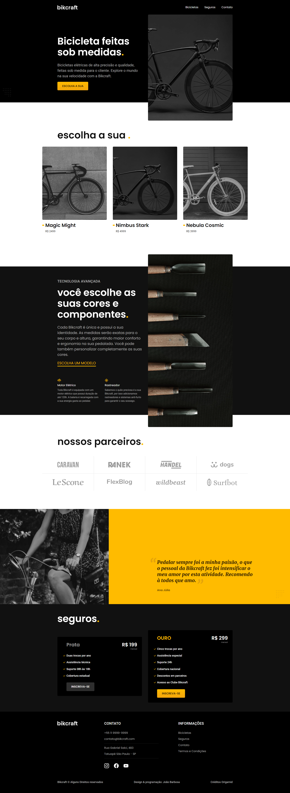

# Projeto Bakcraft

Bem-vindo ao repositório do Projeto Bakcraft! Este projeto apresenta o site da Bakcraft, uma confeitaria e padaria fictícia. Você pode explorar o site ao vivo em [https://joaosbarbosa.github.io/bakcraft-project/](https://joaosbarbosa.github.io/bakcraft-project/).

## Visão Geral do Projeto

O Projeto Bakcraft é um site estático projetado para simular a presença online de uma confeitaria. Ele apresenta uma interface de usuário lindamente projetada com seções para mostrar produtos da padaria, serviços, informações sobre a empresa e detalhes de contato. O site é totalmente responsivo e otimizado para diferentes tamanhos de tela, proporcionando uma experiência perfeita em computadores e dispositivos móveis.

## Tecnologias Utilizadas

- HTML5
- CSS3
- JavaScript
- Design Responsivo

## Recursos

- Página inicial com um cabeçalho acolhedor e um botão de chamada à ação proeminente.
- Seção de produtos exibindo uma seleção de itens de confeitaria com descrições.
- Seção de serviços destacando as ofertas da padaria.
- Página "Sobre" fornecendo informações sobre a história e os valores da empresa.
- Página de contato com um formulário de contato e detalhes para contato.
- Design responsivo que garante uma exibição ideal em vários dispositivos.

## Uso

Para visualizar o site ao vivo, basta seguir este link: [https://joaosbarbosa.github.io/bakcraft-project/](https://joaosbarbosa.github.io/bakcraft-project/)

## Começando

Se você deseja executar este projeto localmente ou explorar o código, siga estas etapas:

1. Clone este repositório: `git clone https://github.com/joaosbarbosa/bakcraft-project.git`
2. Navegue até a pasta do projeto: `cd bakcraft-project`
3. Abra o arquivo `index.html` em seu navegador da web preferido.

## Contribuições

Contribuições para este projeto são bem-vindas! Sinta-se à vontade para abrir problemas para relatar bugs ou solicitar novos recursos.

---

Obrigado por visitar o repositório do Projeto Bakcraft. Se você tiver alguma dúvida ou feedback, não hesite em entrar em contato!

